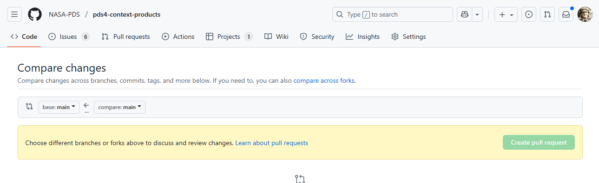
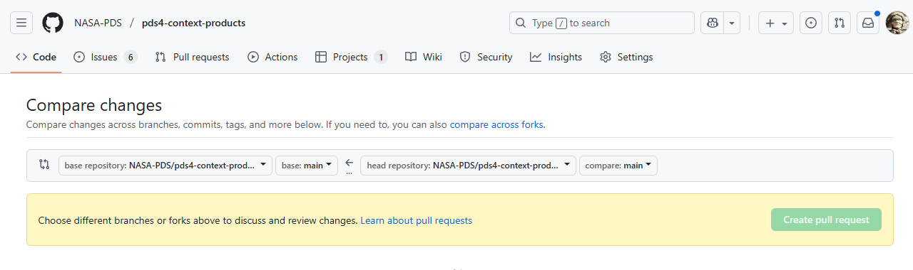

# Creating and Submitting Changes to the NASA-PDS Context Product Repo

This file provides a fair amount of detail and some recipes for creating and editing context
product files that are destined to be incorporated into the official NASA-PDS/pds4-context-products repo. Because only EN has write access to the official repo, a bit of extra procedure is required to submit your own edits and additions. 

- [Prerequisites](#prerequisites)
- [The Overall Workflow](#the-overall-workflow)
- [1. Raising an Issue](#1-raising-an-issue)
- [2. Forking the NASA-PDS Repo](#2-forking-the-nasa-pds-repo)
- [3. Creating a Branch](#3-creating-a-branch)
- [4. Editing the Working Copy](#4-editing-the-working-copy)
  - [Using the GitHub Text Editor](#using-the-github-text-editor)
  - [Using the GitHub Desktop App](#using-the-github-desktop-app)
  - [using git CLI](#using-git-cli)
- [5. Filing a Pull Request (PR)](#5-filing-a-pull-request-pr)
- [EN Processing](#en-processing)

## Prerequisites

You will need a GitHub account. Without an account you cannot raise issues in the NASA-PDS 
repo, and you will need to create a "working copy" of the official repo in which to make
and save your changes before submitting them to the NASA-PDS repo for inclusion.

You will also need to interact with GitHub as some level. This can be through a web browser,
the git command line interface ("git CLI"), through the GitHub Desktop app, or through some 
other method you've already learned. Basic instructions for the first three popular options 
are included below.

## The Overall Workflow

As a reminder, here's the basic workflow:
1. Raise an issue in the NASA-PDS repo if one does not already exist.
2. Fork the NASA-PDS repo into your own GitHub account space to create a working copy.
3. In your working copy of the repo, create a branch with a name that contains the issue number(s) of the related issue(s)
4. Edit the branch of your working repo.
5. When you're done, file a Pull Request in the [NASA-PDS4/pds4-context-products](https://github.com/NASA-PDS/pds4-context-products/pulls) repo to request that EN merge the branch from your working copy into the NASA-PDS repo.

Now for the gory details...

## 1. Raising an Issue

Click on the **Issues** tab in the upper left of the *NASA-PDS/pds4-context-products* repo 
home page. Once on the **Issues** page, click the green **New Issue** button in the upper 
right.

Here's a shortcut: [Raise a Context Product Issue](https://github.com/NASA-PDS/pds4-context-products/issues/new/choose)

Once you've raised the issue, or if the issue already exists, click on the title of the issue 
in the **Issues** list to get to the page for that issue.
If you expect input from other collaborators, refer them to the comment stream on the page 
for your issue. You can work the details here with any interested parties.

When you're ready to start creating/editing context products, you will need to make your own 
working copy of the repo.

## 2. Forking the NASA-PDS Repo

Forking the repo makes a copy under your own GitHub account. From the **Code** page of the 
[NASA-PDS/pds4-context-products](https://github.com/NASA-PDS/pds4-context-products) repo, 
look for the **Fork** button, located on the right 
above the "About" side panel. Unless you know you want something different, the defaults will 
work for the usual context product workflows.

## 3. Creating a Branch

In your working copy of *pds4-context-products*, create a new branch with a name that 
contains the number(s) of the issue(s) you're addressing, and any additional notes you want 
to add. Some example branch names:
- issue_42
- update_target_ch_issue67
- issues34and36

## 4. Editing the Working Copy

At this point you are ready to start editing in your working copy of the repo. There are 
several options for doing this. Three of them are described below:
1. In a browser, using the GitHub text editor
2. On your local system, using the *GitHub Desktop* app
3. On your local system, using *git CLI (Command Line Interface)*

### Using the GitHub Text Editor

Go to the **Code** page for your working copy of *pds4-context-objects* and make sure you are 
on the branch you created by checking the button on the left under the repo name. It should 
*not* say **main**. If it does, pull down the menu and select the branch you created.

Once on the editing branch, in the folder list click on *data/pds4* and then *context-pds4*. 
Then navigate to the folder where you want to add or update a context object. Follow the 
instructions in the [README for the repo](README.md).

To create a new file, click the **Add File** menu in the upper right corner. To edit an 
existing file, first select the file to see the current contents, then click on the pencil 
icon in the upper right of the file display window to edit the file. To rename a file, open 
it in the editor and edit the file name in the edit box above the content display. The edit 
box is at the end of the file path.

When you are done editing, click the green *Commit changes* button in the upper right, add an 
appropriate commit comment, make sure you're committing to the branch you created and not 
"main" and click the green *Commit changes* button at the bottom of the pop-up window to make 
it all official.

### Using the GitHub Desktop App

In GitHub Desktop, start by cloning your working copy from GitHub to your local diskspace:
  - Open the *Current Repository* drop-down menu 
  - Open the *Add* drop-down menu
  - Select "Clone repository..."
  - Select the tab for your preferred method for cloning repos

If you don't have a "preferred method for cloning", try *URL*. In a browser, go to your 
working copy of the *pds4-context-objects* repo, open the drop-down menu for the green 
**Code** button, select the "Local" tab and then "HTTPS". Click the copy icon to copy the 
repo URL, which you can then paste into the URL box in GitHub Desktop. Modify the "Local 
path" as desired and click the blue **Clone** button. If you already created the branch on 
GitHub, then make sure you select the option to download all branches (not just "main"). If 
you didn't, you can create the branch locally once the repo is cloned, but you should then 
publish that branch back to your working repo on GitHub.

Select your cloned working repo (if you just cloned it, it should be set automatically); then 
select your editing branch from the *Current Branch* drop-down menu. (Create a branch if none 
exists and publish it.)

You can now edit, add, and rename files using your usual local methods (editors, file 
explorers, etc.). Git will track your changes. When  
you're done, commit the changes to your branch, and then publish those changes to your
working repo on GitHub.

#### Using git CLI

Here is a [Git CLI Cheat Sheet](https://education.github.com/git-cheat-sheet-education.pdf) 
if you need a quick reference. 

The following assumes you have already performed initialization and credential setup for your 
local git instance. 

In a browser, navigate to the **Code** page for your working *pds4-context-products* repo. 
Open the drop-down menu on the green *Code* button, select the "Local" tab, and click the 
copy icon to copy the URL of your working repo to your clipboard.

At your local command line, start by moving to the directory where you want to create the 
local copy of your working *pds4-context-products* repo. Then do:
```
git clone [pasted URL]
``` 
This will create a copy of the "main" branch of your repo. Move down one level to the 
directory just created (it will be called "pds4-context-objects" unless you specifically did
something to rename it). 

If you already created an editing branch on GitHub, switch to editing that branch by doing:
```
git checkout [branchname]
```
If you didn't, you can create one locally now and then switch to it:
```
git branch [branchname]
git checkout [branchname]
```
Now you can edit files in the directory tree (you should only be working in 
the ```data/pds4/context-pds4``` directories) and the changes will be logged to the new 
branch. 

You can rename an exiting file using ```git mv [oldfilename] [newfilename]```. If you add a 
new file, you will need to navigate to the directory where the new file exists, and 
do ```git add [newfilename]``` to stage the file before committing.

When you've resolved all the file name differences and are ready to upload your edits to 
GitHub, do ```git status```. This will list any discrepancies - like new files you forgot to 
```git add``` - that should be resolved before uploading changes to your working repo. When 
you're ready to publish, do ```git push [branchname]``` to publish your changes to your edit 
branch in GitHub.

### 5. Filing a Pull Request (PR)

Once you've got your changes uploaded to, or otherwise incorporated into your editing branch 
in your working repo, it's time to request that your proposed changes be merged into the 
official repo.

To do this, go to the 
[NASA-PDS4/pds4-context-products](https://github.com/NASA-PDS/pds4-context-products) repo, 
click on the **Pull requests** tab in the upper left, and click on the green **New pull 
request** button. Or use this shortcut: 
[Create a PR on the Context Product Repo](https://github.com/NASA-PDS/pds4-context-products/compare).

You should see something very much like this:


The grey bar provides two drop-down menu bottons. Once of these is labeled "base: main". This 
is where we want our changes to end up - the main branch of the NASA-PDS repo. Next to this 
is an arrow that points to the left, indicating that changes will be pulled from the right to 
the left. The other drop-down, on the right, is labeled "compare: main", and if you click on 
it you will only see other branches in the NASA-PDS repo. We don't want any of those.

Now look *above* that grey bar, to the blue text under the **Compare changes** title that 
reads, "compare across forks". Click on that blue text and you should now see this:


There are now two drop-down buttons on each side of the arrow. On the **right** side of the 
arrow, the fork you made of the NASA-PDS repo should be listed. Click on the drop-down and 
select it. Once you have done that, you can now click on the last drop-down to select the 
branch that contains the edits you made. 

***TEST AND COMPLETE THE PR SUBMISSION PROCESS HERE***

## EN Processing

EN personnel will be notified of the pull request. They will review it and you may be 
contacted if they have questions or if there is some conflict with