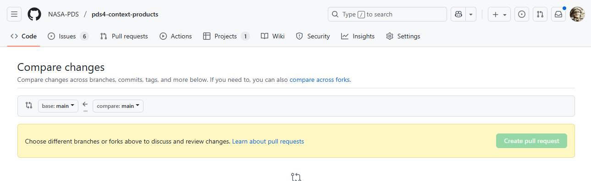

# PDS4 Context Product Management
This repository is for managing the **latest versions** of all PDS4 Context Products across NASA and IPDA archives. It is also the primary conduit for submitting updates to existing context objects, proposing new context objects, and filing issues on existing context objects.

- [Overview](#overview)
- [Raising Issues](#raising-issues)
- [Contributing Updates and New Products](#contributing-updates-and-new-products)
  - [To Request a New or Updated Context Product](#to-request-a-new-or-updated-context-product)
  - [To Create a New Context Product](#to-create-a-new-context-product)
  - [To Update an Existing Context Product](#to-update-an-existing-context-product)
- [Governance](#governance)
  - [Investigation LID Prefix](#investigation-lid-prefix)
  - [Instrument Host LID Prefix](#instrument-host-lid-prefix)
  - [Instrument LID Prefix](#instrument-lid-prefix)
- [Using GitHub Tools to Create and Update Products](#using-github-tools-to-create-and-update-products)

## Overview
 At the IPDA Steering Committee meeting of September 2024, a need was identified for more transparency and better communication regarding the context products that are being created and used across PDS4-based systems in order to avoid duplication and to encourage best practices and collaboration. This repository was established in response to that finding.

**This repository contains only the latest version of each context product. The full, official archive, containing all versions, is curated by the PDS Engineering Node at https://pds.nasa.gov/data/pds4/context-pds4/.**

## Raising Issues

Any GitHub user can raise an issue in this repo. 

Common reasons for raising issues include:
- To request a new context product be created
- To request a modification to the content of an existing context product
- To report a problem noted in an existing context product

For tracking purposes, you should raise an issue even if you plan to do the work yourself. This helps ensure that development is visible to others who might be interested.

Discussion and collaboration on proposed additions and changes happens in the comment thread associated with each issue. 

## Contributing Updates and New Products

If you are planning to make modifications or submit a new context product yourself, here's the workflow:
1. Raise an issue in the NASA-PDS repo if one does not already exist.
2. Fork the NASA-PDS repo into your own GitHub account space to create a working copy.
3. In your working copy of the repo, create a branch with a name that contains the issue 
number(s) of the related issue(s)
4. Edit the branch of your working repo.
5. When you're done, file a Pull Request (PR) in the [NASA-PDS4/pds4-context-products]
(https://github.com/NASA-PDS/pds4-context-products/pulls) repo to request that EN merge the 
branch from your working copy into the NASA-PDS repo.

EN will take it from there.

Details of each step, including information on using the GitHub text editor, the GitHub 
Desktop app, and the git Command Line Interface(CLI) to make and publish changes, are 
provided in [Using GitHub Tools to Create and Update Products](#using-github-tools-to-create-and-update-products), below.

### To Request a New or Updated Context Product
When you need a new context product, or need updates to an existing context product: 
1. Create an issue in the NASA-PDS repository requesting the addition/change. 
Here's a handy link directly to the right "New issue" button: [New issue](https://github.com/NASA-PDS/pds4-context-products/issues/new/choose). 
2. Select "New Context Product Request" for a new product or "Update Context Product Request" 
for a modification, and fill in the form that pops up. 
Include whatever details you have. Do check before raising the issue that someone else hasn't 
already made the same request by checking [the current issues list](https://github.com/NASA-PDS/pds4-context-products/issues).
3. Click the green "Create" button in the lower right corner of the form to submit the 
request.
4. If you expect discussion, or want to get an email notice if someone comments, go back to 
[the current issues list](https://github.com/NASA-PDS/pds4-context-products/issues) and
click on the title of the issue you just submitted. At the bottom of the right column, there
is a "Subscribe" button. Click it to either subscribe or unsubscribe from notifications.

If you are not planning to create or update the context product yourself, you're done (though 
you may be contacted to answer questions or review the product someone else creates for you). 
If you are planning to create/update the product yourself, read on.  

### To Create a New Context Product

You will need to consult the [Guide to PDS4 Context Products](https://pds.nasa.gov/datastandards/documents/context/PDS4_Context_Products_Guide.v3.pdf) for 
logical identifier (LID) formation rules and the related file naming conventions. These 
vary slightly depending on the type of the context product you're creating. Inspecting
a few existing context products of the same type should help to clarify the instructions.
Pay particular attention to ```<type>``` fields, which are often incorporated into file 
names.

For both LIDs and filenames, make a reasonable guess and then post it in the comments
for the related issue, tagging Richard Chen (@rchenatjpl) to ask for a quick review. *EN 
personnel will adjust the LIDs and filenames if needed*, so checking with EN early on 
this point can save the effort of having to change these parameters in any data products you 
might be creating while the new context products are being reviewed. 

The items you need to address to create a new context product are:
- Determine the type of the context product you will create. If in doubt, ask Richard Chen 
(@rchenatjpl) in the issue comments.
- Determine the LID and filename you will use to submit the new product.
- Make sure the file name ends in "_v1.0", with a file extension of ".xml".
- Create the new context product in the corresponding context type folder (a new instrument 
goes in the *context-pds4/instrument* folder, a new mission goes in the *context-pds4/
investigation* folder, etc.). Make sure to use the full file name with the version number and 
extension. 
- Follow the [Guide to PDS4 Context Products](https://pds.nasa.gov/datastandards/documents/context/PDS4_Context_Products_Guide.v3.pdf) 
for including association and other aspects of content specific to the context type. 
- Validate the context product using the *Validate Tool*, if possible.

You only need to focus on creating the context product itself. EN will handle the updates
required to collection inventory files and labels when they resolve your pull request.

Details for working in GitHub to make these changes are covered in [Using GitHub Tools to Create and Update Products](#using-github-tools-to-create-and-update-products), below.

### To Update an Existing Context Product

You must not change either the logical identifier (LID) or file name root when updating an 
existing context product. Depending on the updates needed, you may need to consult the
[Guide to PDS4 Context Products](https://pds.nasa.gov/datastandards/documents/context/PDS4_Context_Products_Guide.v3.pdf) for content details.

When updating an existing Context Product, follow these steps:
- Locate the current version of the product in the *context-pds4* type folder (an instrument 
will be in the *context-pds4/instrument* folder, a mission will be in the *context-pds4/
investigation* folder, etc.).
- Rename the existing file ***only*** to increment the version number at the end of the file name. 
Increment the minor version for a minor change, the major version for a major change.
- Edit the renamed file. The first changes you should make are:
  - Increment the ```<version_id>``` to match the version in the file name.
  - Add a new ```<Modification_Detail>``` to the ```<Modification_History>``` to document
  the changes being made.
- Make whatever additional changes are needed.
- Save the file.  

You only need to focus on updating the context product itself. EN will handle the updates
required to collection inventory files and labels when they resolve your pull request.

Details for working in GitHub to make these changes are covered in [Using GitHub Tools to Create and Update Products](#using-github-tools-to-create-and-update-products), below.

## Governance
With most context products originating from a parent investigation, the lead agency of an investigation governs over the context products that fall under that investigation. Creation and management of context products related to an investigation can be delegated to other affilliated agencies through collaboration and discussion.

For context products that do not originate from an investigation (e.g., a target context product), the agency who identifies and creates the context product will gain ownership over that context product.

### Investigation LID Prefix
LID prefix for the lead agency. If there is not a clear lead agency, then this is determined via discussion amongst the affiliated agencies.

### Instrument Host LID Prefix
LID prefix for the Instrument Host lead agency. If there is not a clear lead agency, then this is determined via discussion amongst the affiliated agencies.

### Instrument LID Prefix
LID prefix for the Instrument lead agency. If there is not a clear lead agency, then this is determined via discussion amongst the affiliated agencies.

************************************

## Using GitHub Tools to Create and Update Products

This section provides a fair amount of detail and some recipes for creating and editing 
context product files that are destined to be incorporated into the official 
NASA-PDS/pds4-context-products repo. Because only EN has write access to the official 
repo, a bit of extra procedure is required to submit your own edits and additions. 

- [Prerequisites](#prerequisites)
- [The Overall Workflow](#the-overall-workflow)
- [1. Raising an Issue](#1-raising-an-issue)
- [2. Forking the NASA-PDS Repo](#2-forking-the-nasa-pds-repo)
- [3. Creating a Branch](#3-creating-a-branch)
- [4. Editing the Working Copy](#4-editing-the-working-copy)
  - [Using the GitHub Text Editor](#using-the-github-text-editor)
  - [Using the GitHub Desktop App](#using-the-github-desktop-app)
  - [using git CLI](#using-git-cli)
- [5. Filing a Pull Request (PR)](#5-filing-a-pull-request-pr)
- [EN Processing](#en-processing)

### Prerequisites

You will need a GitHub account. Without an account you cannot raise issues in the NASA-PDS 
repo. You will also need to create a "working copy" of the official repo in which to make
and save your changes in your own accpunt before submitting them to the NASA-PDS repo for 
inclusion.

You will be interacting with GitHub at some level. This can be through a web browser,
the git command line interface ("git CLI"), through the GitHub Desktop app, or through some 
other method you've already learned. Basic instructions for the three common options just 
mentioned are included below.

### The Overall Workflow

As a reminder, here's the basic workflow:
1. Raise an issue in the NASA-PDS repo if one does not already exist.
2. Fork the NASA-PDS repo into your own GitHub account space to create a working copy.
3. In your working copy of the repo, create a branch with a name that contains the issue 
number(s) of the related issue(s)
4. Edit the branch of your working repo.
5. When you're done, file a Pull Request in the [NASA-PDS4/pds4-context-products](https://github.com/NASA-PDS/pds4-context-products/pulls) repo to request that EN merge the branch from your working copy into the NASA-PDS repo.

Now for the gory details...

----
### 1. Raising an Issue

Click on the **Issues** tab in the upper left of the *NASA-PDS/pds4-context-products* repo 
home page. Once on the **Issues** page, click the green **New Issue** button in the upper 
right.

Here's a shortcut: [Raise a Context Product Issue](https://github.com/NASA-PDS/pds4-context-products/issues/new/choose)

Once you've raised the issue, or if the issue already exists, click on the title of the issue 
in the **Issues** list to get to the page for that issue.
If you expect input from other collaborators, refer them to the comment stream on the page 
for your issue. You can work the details here with any interested parties.

When you're ready to start creating/editing context products, you will need to make your own 
working copy of the repo.

----
### 2. Forking the NASA-PDS Repo

Forking the repo makes a copy under your own GitHub account. From the **Code** page of the 
[NASA-PDS/pds4-context-products](https://github.com/NASA-PDS/pds4-context-products) repo, 
look for the **Fork** button, located on the right 
above the "About" side panel. Unless you know you want something different, the defaults will 
work for the usual context product workflows.

----
### 3. Creating a Branch

Back in your own account, in your working copy of *pds4-context-products*, create a new 
branch with a name that 
contains the number(s) of the issue(s) you're addressing, and any additional notes you want 
to add. Some example branch names:
- issue_42
- update_target_cg_issue67
- issues34and36

----
### 4. Editing the Working Copy

At this point you are ready to start editing in your working copy of the repo. There are 
several options for doing this. Three of them are described below:
1. In a browser, using the GitHub text editor
2. On your local system, using the *GitHub Desktop* app
3. On your local system, using *git CLI (Command Line Interface)*

#### Using the GitHub Text Editor

Go to the **Code** page for your working copy of *pds4-context-objects* and make sure you are 
on the branch you created by checking the button on the left under the repo name. It should 
*not* say **main**. If it does, pull down the menu and select the branch you created for this 
issue.

Once on the editing branch, in the folder list click on *data/pds4* and then *context-pds4*. 
Then navigate to the folder where you want to add or update a context object. Follow the 
instructions in the [README for the repo](README.md) to either [add](README.md#to-create-a-new-context-product) or [update](README.md#to-update-an-existing-context-product) the product.

To create a new file, click the **Add File** menu in the upper right corner. To edit an 
existing file, first select the file to see the current contents, then click on the pencil 
icon in the upper right of the file display window to edit the file. To rename a file, open 
it in the editor and edit the file name in the edit box above the content display. The edit 
box is at the end of the file path.

When you are done editing, click the green *Commit changes* button in the upper right, add an 
appropriate commit comment, make sure you're committing to the branch you created and not 
"main", and click the green *Commit changes* button at the bottom of the pop-up window to 
make it all official.

#### Using the GitHub Desktop App

In GitHub Desktop, start by cloning your working copy from GitHub to your local disk space:
  - Open the *Current Repository* drop-down menu 
  - Open the *Add* drop-down menu
  - Select "Clone repository..."
  - Select the tab for your preferred method for cloning repos

If you don't have a "preferred method for cloning", try *URL*. In a browser, go to your 
working copy of the *pds4-context-objects* repo in GitHub, 
open the drop-down menu for the green 
**Code** button, select the "Local" tab and then "HTTPS". Click the copy icon to copy the 
repo URL, which you can then paste into the URL box in GitHub Desktop. In Desktop, modify the 
"Local 
path" as desired and click the blue **Clone** button. If you already created the branch on 
GitHub, then make sure you select the option to download all branches (not just "main"). If 
you didn't, you can create the branch locally once the repo is cloned, but you should then 
publish that branch back to your working repo on GitHub.

Select your cloned working repo (if you just cloned it, it should be set automatically); then 
select your editing branch from the *Current Branch* drop-down menu. (Create a branch if none 
exists and publish it.)

You can now edit, add, and rename files using your usual local methods (editors, file 
explorers, etc.). Git will track your changes. When  
you're done, commit the changes to your branch, and then publish those changes to the 
same branch in your
working repo on GitHub.

#### Using git CLI

Here is a [Git CLI Cheat Sheet](https://education.github.com/git-cheat-sheet-education.pdf) 
if you need a quick reference. 
The following assumes you have already performed initialization and credential setup for your 
local git instance. 

In a browser, navigate to the **Code** page for your working *pds4-context-products* repo. 
Open the drop-down menu on the green *Code* button, select the "Local" tab, and click the 
copy icon to copy the URL of your working repo to your clipboard.

At your local command line, start by moving to the directory where you want to create the 
local copy of your working *pds4-context-products* repo. Then do:
```
git clone [pasted URL]
``` 
This will create a copy of the "main" branch of your repo. Move down one level to the 
directory just created (it will be called "pds4-context-objects" unless you specifically did
something to rename it). 

If you already created an editing branch on GitHub, switch to editing that branch by doing:
```
git checkout [branchname]
```
If you didn't, you can create one locally now and then switch to it:
```
git branch [branchname]
git checkout [branchname]
```
Now you can edit files in the directory tree (you should only be working in 
the ```data/pds4/context-pds4``` directories) and the changes will be logged to the new 
branch. 

You can rename an exiting file using ```git mv [oldfilename] [newfilename]```. If you add a 
new file, you will need to navigate to the directory where the new file exists and 
do ```git add [newfilename]``` to stage the new file before committing to the branch.

When you've resolved all the file name differences and are ready to upload your edits to 
GitHub, do ```git status```. This will list any discrepancies - like new files you forgot to 
```git add``` - that should be resolved before uploading changes to your working repo. When 
you're ready to publishdo that, do ```git push [branchname]``` to publish your changes to 
your editing branch in GitHub.

----
### 5. Filing a Pull Request (PR)

Once you've got your changes uploaded to, or otherwise incorporated into your editing branch 
in your working repo, it's time to request that your proposed changes be merged into the 
official repo.

To do this, go to the 
[NASA-PDS4/pds4-context-products](https://github.com/NASA-PDS/pds4-context-products) repo, 
click on the **Pull requests** tab in the upper left, and click on the green **New pull 
request** button. Or use this shortcut: 
[Create a PR on the Context Product Repo](https://github.com/NASA-PDS/pds4-context-products/compare).

You should see something very much like this:


The grey bar provides two drop-down menu bottons. Once of these is labeled "base: main". This 
is where we want our changes to end up - the main branch of the NASA-PDS repo. Next to this 
is an arrow that points to the left, indicating that changes will be pulled from the right to 
the left. The other drop-down, on the right, is labeled "compare: main", and if you click on 
it you will only see other branches in the NASA-PDS repo. We don't want any of those.

Now look *above* that grey bar, to the blue text under the **Compare changes** title that 
reads, "compare across forks". Click on that blue text and you should now see this:


There are now two drop-down buttons on each side of the arrow. On the **right** side of the 
arrow, the fork you made of the NASA-PDS repo should be listed. Click on the drop-down and 
select it. Once you have done that, you can now click on the last drop-down to select the 
branch that contains the edits you made. 

***TEST AND COMPLETE THE PR SUBMISSION PROCESS HERE***

## EN Processing

EN personnel will be notified of the pull request. They will review it and you may be 
contacted if they have questions or if there is some conflict with existing products or 
requirements.
